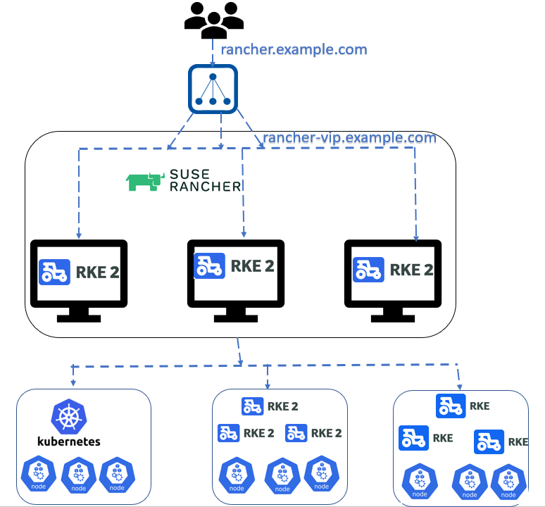
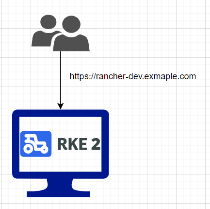
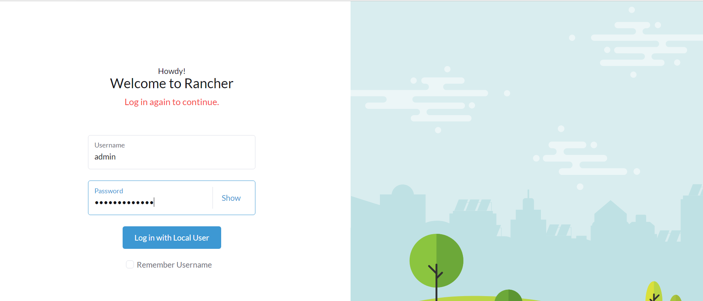
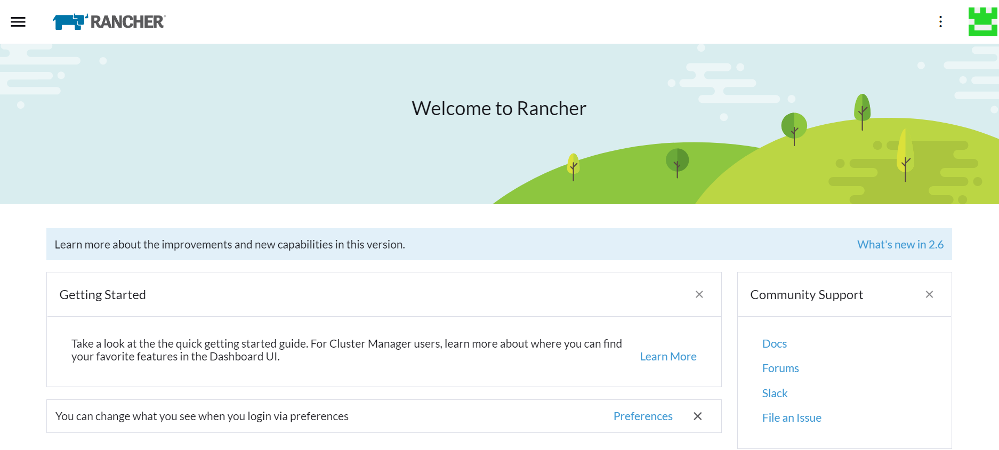
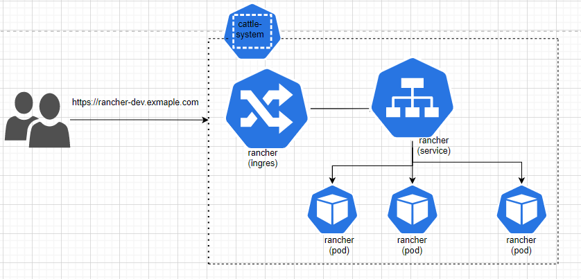
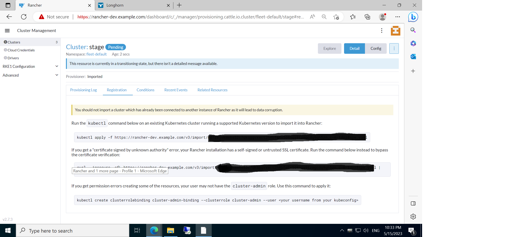
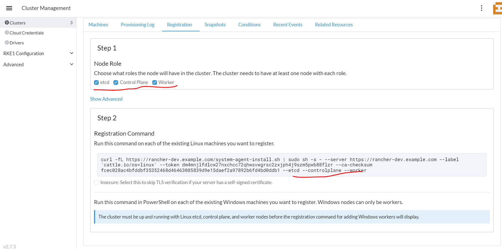
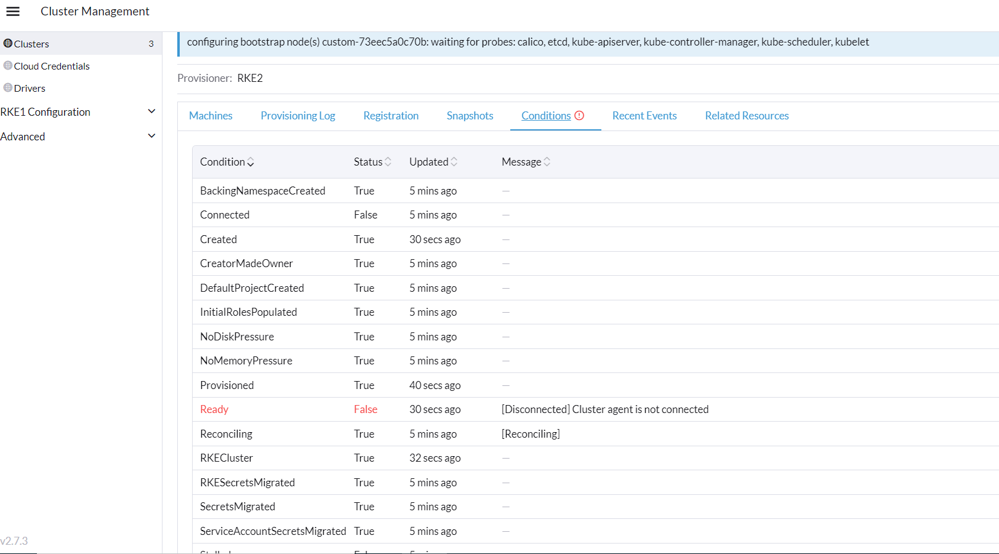
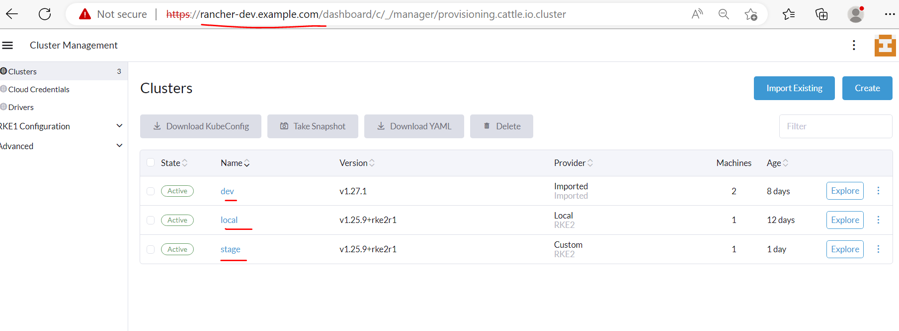

# Rancher setup
# Table of contents
1. [Introduction](#introduction)
2. [Setup Rancher in HA mode](#HA)  
  a. [Architecture](#Architecture)  
  b. [Configure a fixed registration address](#registration)  
  c. [Launch the first server node and Set up the RKE2 Server](#setuprke)  
  d. [Join additional server nodes](#additional)    
3. [Setup Rancher in Standalone mode](#SA)  
  a. [Architecture](#ArchitectureSA)  
  b. [Launch the first server node, Install Kubernetes,and   Set up the RKE2 Server](#setuprkeSA) 

4. [Install Rancher(It is common for both HA and standalone)](#rancher)  
5. [Import Existing cluster to Rancher](#importcluster)
6. [Create a new cluster from Rancher](#createcluster)

## Introduction <a name="introduction"></a>
Rancher is a software stack to manage multiple Kubernetes clusters. It eases the operation and security challenges of managing multiple Kubernetes clusters across any infrastructure. It also helps the teams with integrated tools for running containerized workloads.  
It is open-source and developed by Rancher Lab. The Rancher is acquired by SUSE in December 2020.
It can be used for managing multiple clusters, importing the existing clusters, and deploying the new cluster as well.
  
It provides infrastructure orchestration that is you can manage the clusters from the console and perform many clusters-related operations such as backup and restores of etcd, upgrading of the cluster, adding and removing the nodes, deploying the workload, enabling continuous delivery using, etc.  

It also provides the application catalog which is also known as `Marketplace`. The marketplace is nothing but Helm charts. These charts can be easily installed using the console. There are also server other repositories included, and you can add your own to deploy your charts/app to your cluster. The app deploying runs the helm command in the backend.  

Rancher can be deployed using the `RKE` and `RKE2`. The Rancher Kubernetes Engine(RKE) is a CNCF-certified Kubernetes distribution that runs entirely within Docker containers. The RKE2, also known as RKE Government, is a Kubernetes distribution that focuses on security and compliance for U.S. Federal Government entities.RKE2 is considered the next iteration of the Rancher Kubernetes Engine. RKE1 uses Docker for deploying and managing control plane components, and it also uses Docker as the container runtime for Kubernetes. By contrast, RKE2 launches control plane components as static pods that are managed by the kubelet. RKE2’s container runtime is containerd.

The Rancher can be set up as Highly Available(HA) or Standalone mode(Single node)  

### Setup Rancher in HA mode <a name="HA"></a>

#### Architecture <a name="Architecture"></a>
We will be going to set up the Rancher using RKE2 on Ubuntu 18.04 VMS. The architecture diagram of our current deployment is shown below:
   

An HA RKE2 cluster consists of:

* A fixed registration address that is placed in front of server nodes to allow other nodes to register with the cluster
* An odd number (three recommended) of server nodes that will run etcd, the Kubernetes API, and other control plane services

The current system details of Racher set up as:

| Hostname                | Ip address      | 
| ------------------------| --------------- |
| rancher01               | 192.168.56.101  |
| rancher02               |  192.168.56.102 |
| rancher03               | 192.168.56.103  |
| rancher-vip.example.com | 192.168.56.20   |
| rancher.example.com     | 5.195.2.3       |


 Setting up an HA cluster requires the following steps:

* Configure a fixed registration address
* Launch the first server node, Install Kubernetes and Set up the RKE2 Server
* Join additional server nodes

#### Configure a fixed registration address <a name="registration"></a>
Server nodes beyond the first one and all agent nodes need a URL to register against. This endpoint can be set up using any number of approaches, such as:  
* A layer 4 (TCP) load balancer
* Round-robin DNS
* Virtual or elastic IP addresses  
This endpoint can also be used for accessing the Kubernetes API. So you can, for example, modify your kube config file to point to it instead of a specific node.  

Note that the rke2 server process listens on port 9345 for new nodes to register. The Kubernetes API is served on port 6443, as normal.  

We will be using a virtual IP address such as `rancher-vip.example.com`  

#### Launch the first server node and Set up the RKE2 Server <a name="setuprke"></a>
The first server node establishes the secret token that other server or agent nodes will register with when connecting to the cluster.  
The steps for installing and configuring the server node are:
* Add the nodes details in `/etc/hosts` files:
```
192.168.56.101	rancher01
192.168.56.102	rancher02
192.168.56.103	rancher03
192.168.56.20	rancher-vip.example.com
```
* Create a directory and create the RKE2 config file manually.

To avoid certificate errors with the fixed registration address, you should launch the server with the tls-san parameter set. This option adds an additional hostname or IP as a Subject Alternative Name in the server’s TLS cert, and it can be specified as a list if you would like to access via both the IP and the hostname.  

First, you must create the directory where the RKE2 config file is going to be placed:
```
mkdir -p /etc/rancher/rke2/
```
Next, create the RKE2 config file at /etc/rancher/rke2/config.yaml using the following example:
```
tls-san:
  - rancher-vip.example.com
  - 192.168.56.101
  - rancher01
  - 192.168.56.102
  - rancher02
  - 192.168.56.103
  - rancher03
  ```
* Run the installer and enable, then start, rke2
```
curl -sfL https://get.rke2.io | sh -
systemctl enable rke2-server.service
systemctl start rke2-server.service
```
`rke2-server.service` will take some time to come up. you can observe its logs using `journalctl -u rke2-server -f` command  
`Note:` Additional utilities will be installed at `/var/lib/rancher/rke2/bin/`. They include: `kubectl`, `crictl`, and `ctr`.  

Two cleanup scripts will be installed to the path at `/usr/local/bin/rke2`. They are: `rke2-killall.sh` and `rke2-uninstall.sh`. A kubeconfig file will be written to `/etc/rancher/rke2/rke2.yaml`.A token that can be used to register other server or agent nodes will be created at `/var/lib/rancher/rke2/server/node-token`

* Copy the `kubectl` and configure `kubecofig`
```
cp /var/lib/rancher/rke2/bin/kubectl /usr/local/bin/
chmod +x /usr/local/bin/kubectl
export KUBECONFIG=/etc/rancher/rke2/rke2.yaml
kubectl get nodes -o wide
This will give output as:
NAME               STATUS   ROLES                       AGE     VERSION          INTERNAL-IP      EXTERNAL-IP   OS-IMAGE             KERNEL-VERSION      CONTAINER-RUNTIME
rancher01   Ready    control-plane,etcd,master   3m31s   v1.23.9+rke2r1   192.168.56.101   <none>        Ubuntu 18.04.4 LTS   5.4.0-100-generic   containerd://1.5.13-k3s1
```
You can also use the kubectl from rancher directory itself
```
/var/lib/rancher/rke2/bin/kubectl \
        --kubeconfig /etc/rancher/rke2/rke2.yaml get pods --all-namespaces
```
#### Join additional server nodes <a name="additional"></a>
Additional server nodes are launched much like the first, except that you must specify the server and token parameters so that they can successfully connect to the initial server node.

Steps to configure 2nd and 3rd nodes are:
* Add the nodes details in `/etc/hosts` files:
```
192.168.56.101	rancher01
192.168.56.102	rancher02
192.168.56.103	rancher03
192.168.56.20	rancher-vip.example.com
```
* Create a direcroty and create the RKE2 config file manually.

First, you must create the directory where the RKE2 config file is going to be placed:
```
mkdir -p /etc/rancher/rke2/
```
Next, create the RKE2 config file at /etc/rancher/rke2/config.yaml using the following example. Please note that token can be found in `/var/lib/rancher/rke2/server/node-token` file on the server node.
```
token: xxxxxxxxxxxxxxxxxxxxxxxxxxxxxxxxxxxxxxxxxxxxxxxxxxxxxxxxxxx
server: https://rancher-vip.example.com:9345
tls-san:
  - rancher-vip.example.com
  - 192.168.56.101
  - rancher01
  - 192.168.56.102
  - rancher02
  - 192.168.56.103
  - rancher03
  ```
* Run the installer and enable, then start, rke2
```
curl -sfL https://get.rke2.io | sh -
systemctl enable rke2-server.service
systemctl start rke2-server.service
```
`rke2-server.service` will take some time to come up. you can observe its logs using `journalctl -u rke2-server -f` command

* Confirm cluster is functional¶
Once you've launched the rke2 server process on all server nodes, ensure that the cluster has come up properly with
```
/var/lib/rancher/rke2/bin/kubectl \
        --kubeconfig /etc/rancher/rke2/rke2.yaml get nodes
```
This *concludes* and the `RKE2` installation in HA mode, Next we will Setup the `Rancher` on the server or 1st node

### Setup Rancher in Standalone mode <a name="SA"></a>

#### Architecture <a name="Architecture"></a>
We will be going to set up the Rancher using RKE2 on Ubuntu 18.04 VMS. The architecture diagram of our current deployment is shown below:
   

A Standalone RKE2  consists of:

* We need to have a Ubuntu VM and a temporary FQDN name that will be pointing to the same host.

The current system details of Racher set up as:

| Hostname                | Ip address      | 
| ------------------------| --------------- |
| rancherdev              | 192.168.56.105  |
| rancher-dev.example.com | 192.168.56.105  |  


 Setting up Rancher following steps:

* Launch the first server node and Set up the RKE2 Server

#### Launch the first server node and Set up the RKE2 Server <a name="setuprkeSA"></a>
The first server node establishes the secret token that other server or agent nodes will register with when connecting to the cluster.  
The steps for installing and configuring the server node are:
* Add the nodes details in `/etc/hosts` files:
```
192.168.56.105	rancherdev
```
* Create a directory and create the RKE2 config file manually.

To avoid certificate errors with the fixed registration address, you should launch the server with the tls-san parameter set. This option adds an additional hostname or IP as a Subject Alternative Name in the server’s TLS cert, and it can be specified as a list if you would like to access via both the IP and the hostname.  

First, you must create the directory where the RKE2 config file is going to be placed:
```
mkdir -p /etc/rancher/rke2/
```
Next, create the RKE2 config file at /etc/rancher/rke2/config.yaml using the following example:
```
tls-san:
  - rancherdev
  - 192.168.56.105
  ```
* Run the installer and enable, then start, rke2
```
curl -sfL https://get.rke2.io | sh -
systemctl enable rke2-server.service
systemctl start rke2-server.service
```
`rke2-server.service` will take some time to come up. you can observe its logs using `journalctl -u rke2-server -f` command  
`Note:` Additional utilities will be installed at `/var/lib/rancher/rke2/bin/`. They include: `kubectl`, `crictl`, and `ctr`.  

Two cleanup scripts will be installed to the path at `/usr/local/bin/rke2`. They are: `rke2-killall.sh` and `rke2-uninstall.sh`. A kubeconfig file will be written to `/etc/rancher/rke2/rke2.yaml`.A token that can be used to register other server or agent nodes will be created at `/var/lib/rancher/rke2/server/node-token`

* Copy the `kubectl` and configure `kubecofig`
```
cp /var/lib/rancher/rke2/bin/kubectl /usr/local/bin/
chmod +x /usr/local/bin/kubectl
export KUBECONFIG=/etc/rancher/rke2/rke2.yaml
kubectl get nodes -o wide
This will give output as:
NAME               STATUS   ROLES                       AGE     VERSION          INTERNAL-IP      EXTERNAL-IP   OS-IMAGE             KERNEL-VERSION      CONTAINER-RUNTIME
rancherdev   Ready    control-plane,etcd,master   3m31s   v1.23.9+rke2r1   192.168.56.105   <none>        Ubuntu 18.04.4 LTS   5.4.0-100-generic   containerd://1.5.13-k3s1
```
You can also use the kubectl from rancher directory itself
```
/var/lib/rancher/rke2/bin/kubectl \
        --kubeconfig /etc/rancher/rke2/rke2.yaml get pods --all-namespaces
```

This *concludes* the `RKE2` installation , Next we will Setup the `Rancher` on the server or 1st node.  
`Note:` You can setup either HA or standalone Rancher then proceed with the Rancher installation  

# Install Rancher <a name="rancher"></a>
We will install the `Rancher` using `Helm` on the first server node only.  
Steps for Installing Rancher:
* Install Helm
```
wget https://get.helm.sh/helm-v3.9.4-linux-amd64.tar.gz
 tar -xvzf helm-v3.9.4-linux-amd64.tar.gz
  linux-amd64/helm /usr/local/bin/helm
  ```
  * Add rancher Helm repo
  ```
  helm repo add rancher-stable https://releases.rancher.com/server-charts/stable
  helm repo update
  ```

  * Create `cattle-system` namespace
  ```
  kubectl create namespace cattle-system
  ```
  * Choose your SSL Configuration  
    The Rancher management server is designed to be secure by default and requires SSL/TLS configuration.  
    * Rancher-generated TLS certificate: In this case, you will need to install `cert-manager` into the cluster. Rancher utilizes cert-manager to issue and maintain its certificates. Rancher will generate a CA certificate of its own, and sign a cert using that CA. cert-manager is then responsible for managing that certificate.

    * Let's Encrypt: The Let's Encrypt option also uses `cert-manager`. However, in this case, cert-manager is combined with a special Issuer for Let's Encrypt that performs all actions (including request and validation) necessary for getting a Let's Encrypt issued cert
    * Bring your own certificate: This option allows you to bring your own public- or private-CA signed certificate. Rancher will use that certificate to secure websocket and HTTPS traffic  

  We will be using the `Rancher-generated TLS certificate` so we will be insalling `cert manager` before installing Rancher.

  * Install Cert Manager  
    * Install CRDs manually
    ```
      kubectl apply -f https://github.com/cert-manager/cert-manager/releases/download/v1.11.0/cert-manager.crds.yaml
    ```
    * Add the Jetstack Helm repository
    ```
      helm repo add jetstack https://charts.jetstack.io
    ```
    * Update your local Helm chart repository cache
      helm repo update
    * Install the cert-manager Helm chart
      ```
      helm install cert-manager jetstack/cert-manager \
      --namespace cert-manager \
      --create-namespace \
      --version v1.11.0
      ```
    * Once you’ve installed cert-manager, you can verify it is deployed correctly by checking the cert-manager namespace for running pods:
    ```
    kubectl get pods --namespace cert-manager

    NAME                                       READY   STATUS    RESTARTS   AGE
    cert-manager-5c6866597-zw7kh               1/1     Running   0          2m
    cert-manager-cainjector-577f6d9fd7-tr77l   1/1     Running   0          2m
    cert-manager-webhook-787858fcdb-nlzsq      1/1     Running   0          2m
    ```

  * Install Rancher
  ```
  helm install rancher rancher-stable/rancher --namespace cattle-system --set hostname=rancher.example.com --set bootstrapPassword='Password@123' --set ingress.tls.source=rancher
  ```
  *Note:* For installing Rancher for dev, use hostname as `rancher-dev.example.com` and edit your local host file to resolve `rancher-dev.example.com` to `192.168.56.105`  
  * Verify the installation
  ```
  kubectl get all -n cattle-system
  NAME                           READY   STATUS    RESTARTS   AGE
  pod/rancher-86cccxxxxx-lrh7z   1/1     Running   0          93s
  pod/rancher-86cccxxxxx-nqt85   1/1     Running   0          93s
  pod/rancher-86cccxxxxx-rjggf   1/1     Running   0          93s
  ```  

  *rancher.example.com* is  a load balancer  
  *bootstrapPassword* is used to log in Rancher UI  
  *NOTE:* Rancher may take several minutes to fully initialize. Please standby while Certificates are being issued, Containers are started and the Ingress rule comes up. If you don't have a load balancer then you can manually point `rancher.example.com` to one of the server nodes for example `192.168.56.101` and browse the `https://rancher.example.com` to access the rancher using `admin` username and `Password@123` as password


   

  

The below diagram helps you understand the different componets and services involved while access `https://rancher-dev.example.com(For standalone)` or `https://rancher.example.com(for HA)`



You can get details of each componets such ingress, service and pod using `kubectl describe` command as give below:
```
kubectl describe ingress rancher -n cattle-system
Name:             rancher
Labels:           app=rancher
                  app.kubernetes.io/managed-by=Helm
                  chart=rancher-2.7.3
                  heritage=Helm
                  release=rancher
Namespace:        cattle-system
Address:          192.168.56.105
Ingress Class:    <none>
Default backend:  <default>
Rules:
  Host                     Path  Backends
  ----                     ----  --------
  rancher-dev.example.com
                              rancher:80 (10.42.0.15:80,10.42.0.16:80,10.42.0.17:80)
Annotations:               field.cattle.io/publicEndpoints:
                             [{"addresses":["192.168.56.105"],"port":80,"protocol":"HTTP","serviceName":"cattle-system:rancher","ingressName":"cattle-system:rancher","ho...

```
```
kubectl describe service  rancher -n cattle-system
Name:              rancher
Namespace:         cattle-system
Labels:            app=rancher
                   app.kubernetes.io/managed-by=Helm
                   chart=rancher-2.7.3
                   heritage=Helm
                   release=rancher
Annotations:       meta.helm.sh/release-name: rancher
                   meta.helm.sh/release-namespace: cattle-system
Selector:          app=rancher
Type:              ClusterIP
IP Family Policy:  SingleStack
IP Families:       IPv4
IP:                10.43.182.116
IPs:               10.43.182.116
Port:              http  80/TCP
TargetPort:        80/TCP
Endpoints:         10.42.0.15:80,10.42.0.16:80,10.42.0.17:80
Port:              https-internal  443/TCP
TargetPort:        444/TCP
Endpoints:         10.42.0.15:444,10.42.0.16:444,10.42.0.17:444
Session Affinity:  None
Events:            <none>

```

That's all folks for setting up the Rancher!. Let add some existing Kubernetes cluster and new cluster to it.  

### Import existing cluster to the Rancher <a name="importcluster"></a>  

We can manage the existing Kubernetes cluster from Rancher but first, we need to import to the Rancher. The Rancher doesn't Provision the Kubernetes but we need to install and configure the Kubernetes. It only set up the rancher agent that we called `cluster agent` to communicate with the cluster.  

Import the cluster from Rancher UI as follows:  
Clusters page -> Add Cluster -> Import -> Enter a Cluster Name -> create  


* Your cluster is imported and assigned a state of Pending. Rancher is deploying resources to manage your cluster.  
* You can access your cluster after its state is updated to Active.  
* Active clusters are assigned two Projects: Default (containing the namespace default) and System (containing the namespaces cattle-system, ingress-nginx, kube-public, and kube-system, if present).

You can check the status of the cluster agent pod by running 
  
```
kubectl get pods -n cattle-system
NAME                                    READY   STATUS    RESTARTS        AGE
cattle-cluster-agent-679b4d6ff6-6rshl   1/1     Running   19 (7d2h ago)   7d3h
```
It may be in `CrashLoopBackOff` status due to it may unable to resolve your custom domain name which is `rather-dev.example.com` in our case. You can check it by reading the logs of that pod as `kubectl logs cattle-cluster-agent-679b4d6ff6-6rshl -n cattle-system`  
To fix it, we need to add the entry in coredns config map so that by executing this command:
  
```
kubectl edit configmap/coredns -n kube-system

apiVersion: v1
data:
  Corefile: |
    .:53 {
        errors
        health {
           lameduck 5s
        }
        ready
        kubernetes cluster.local in-addr.arpa ip6.arpa {
           pods insecure
           fallthrough in-addr.arpa ip6.arpa
           ttl 30
        }
        hosts custom.hosts rancher-dev.example.com {
           192.168.56.105 rancher-dev.example.com
           Fallthrough
        }
        prometheus :9153
        forward . /etc/resolv.conf {
           max_concurrent 1000
        }
        cache 30
        loop
        reload
        loadbalance
    }
```  
You can see in the above configmap content, we have appended our custom domain name `rancher-dev.example.com`. This will fix the issue and `cluster agent` pod will be running state and the cluster will be in an `Active` state on the Ranhcer dashboard.

### Create a new cluster from Rancher<a name="createcluster"></a> 
Rancher simplifies the creation of the Kubernetes cluster but it uses the Rancher Kubernetes Engine (RKE/RKE2). RKE is Ranhcer's own Kubernetes installer.  
Create a new cluster from Rancher UI as follows:  
Home Dashboard -> create -> use custom -> Enter cluster Name -> select require a version of RKE  and other option-> select the role of a node such as control plane, worker node, etcd -> execute the given command on the node(vm)


  

You may also face a similar issue of not resolving the `custom` dns name `rancher-dev.example.com` so we need to apply a similar hack that is edit coredns to resolve the issue.   
Since we have set up this cluster from Rancher, so it uses the RKE installer to set up the Kubernetes, we need to copy the `kubectl` and export `config` file first.

```
cp /var/lib/rancher/rke2/bin/kubectl /usr/local/bin/
chmod +x /usr/local/bin/kubectl
export KUBECONFIG=/etc/rancher/rke2/rke2.yaml
```

```
kubectl -n kube-system edit configmap/rke2-coredns-rke2-coredns

apiVersion: v1
data:
  Corefile: ".:53 {\n    errors \n    health  {\n        lameduck 5s\n    }\n    ready
    \n    kubernetes   cluster.local  cluster.local in-addr.arpa ip6.arpa {\n        pods
    insecure\n        fallthrough in-addr.arpa ip6.arpa\n        ttl 30\n    }\n    hosts
    \  custom.hosts rancher-dev.example.com {\n        192.168.56.105  rancher-dev.example.com\n
    \   }\n    prometheus   0.0.0.0:9153\n    forward   . /etc/resolv.conf\n    cache
    \  30\n    loop \n    reload \n    loadbalance \n}"
kind: ConfigMap
metadata:
  annotations:
    meta.helm.sh/release-name: rke2-coredns
    meta.helm.sh/release-namespace: kube-system
  creationTimestamp: "2023-05-16T17:48:41Z"
  labels:
    app.kubernetes.io/instance: rke2-coredns
    app.kubernetes.io/managed-by: Helm
    app.kubernetes.io/name: rke2-coredns
    helm.sh/chart: rke2-coredns-1.19.402
    k8s-app: kube-dns
    kubernetes.io/cluster-service: "true"
    kubernetes.io/name: CoreDNS
  name: rke2-coredns-rke2-coredns
  namespace: kube-system
  resourceVersion: "9029"
  uid: 14908b88-ddd0-49d0-9a5d-8903849fa958
```
That's all folks, we are done with the Rancher set. The snapshot shows `the standalone` Rancher setup with `an imported(dev)` and a newly created (stage)cluster`. Please note that `the local` cluster is our rancher cluster(where we have installed the Rancher)
 

Thank you, all for checking out this tutorial, Please give me a `star` if this is helpful for you!


